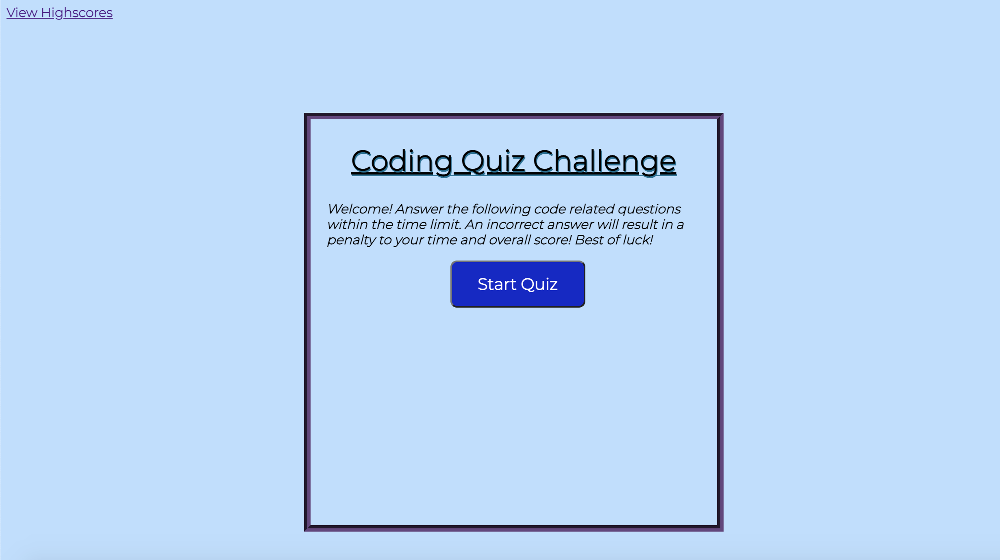

# Code-Quiz-Challenge

<h2>Description</h2>

* I was tasked with creating a coding assessment quiz which is designed to test the knowledge of any web developer in a multiple choice type test environment. The goal of the quiz is to complete all the questions within a given time limit. If the user answers a question wrong, a penalty is dealt out by subtracting time off the clock. After the user gets to the end of the quiz, they are prompted to enter their initials and hit submit their scores. The user has the option to play the quiz again, or if they choose, they can opt to clear all the high scores.

* If the time runs out before the user is able to complete the quiz, they are prompted that the time has expired and are prompted to play again.

<h2>Links</h2>

* Check out the deployed Code Quiz @ https://tylerhance.github.io/Code-Quiz-Challenge/

